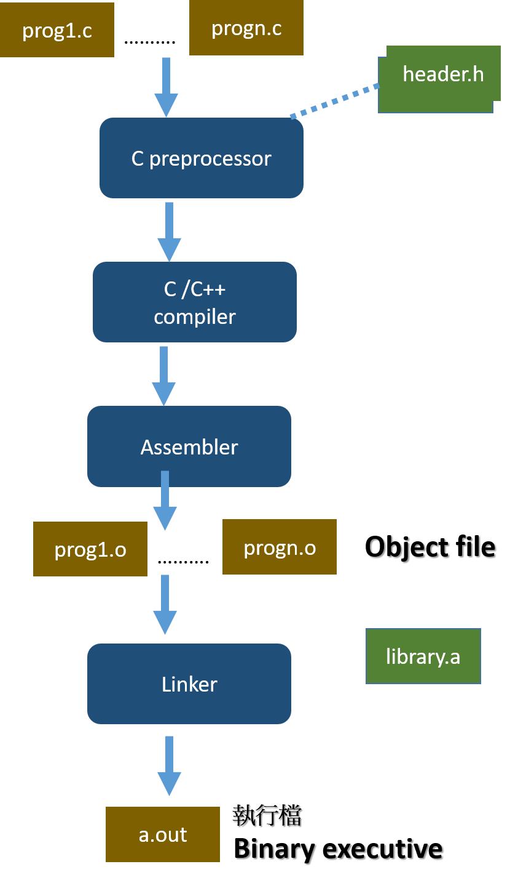

# FromSourceToExecutive

# 1.Linux C 程式的編譯與運行:
## 範例
```
// helloCTFer.c
#include <stdio.h>

int main()
{
   printf("Hello CTFer\n ”);
   return 0;
}
```
### Kali 實作
- 用leafpad寫c code


## Unumtu 18.04 LTS/Kali Linux

| (1) 編譯 | (2)執行 |(3)檢查執行檔檔案格式|
|-----------------------|-------------|-------------|
| gcc helloCTFer.c   ==>  產生a.out執行檔 |  ./a.out | file ./a.out|
|gcc helloCTFer.c -o helloCTFer |./helloCTFer   | file ./helloCTFer   |
|gcc helloCTFer.c -o helloCTFer.exe | ./helloCTFer.exe | file ./helloCTFer.exe|

- strings ./helloCTFer
- hexdump -C helloCTFer.exe


- [ELF File magic](https://unix.stackexchange.com/questions/153352/what-is-elf-magic)
- hexdump 的用法
```
usage: hexdump [-bcCdovx] [-e fmt] [-f fmt_file] [-n length]
               [-s skip] [file ...]
       hd      [-bcdovx]  [-e fmt] [-f fmt_file] [-n length]
               [-s skip] [file ...]

hexdump還有很多的用法，具體可以參看man hexdump
https://man7.org/linux/man-pages/man1/hexdump.1.html

https://man.linuxde.net/hexdump
https://www.itread01.com/article/1513751613.html
https://www.itread01.com/p/1385440.html
```
### Kali 實作

- strings test.exe


- hexdump test.exe (產生16位元訊息)


- hexdump -C test.exe


- ELF File magic
```
readelf -h /bin/ls
ELF Header:
  Magic:   7f 45 4c 46 02 01 01 00 00 00 00 00 00 00 00 00 
  Class:                             ELF64
  Data:                              2's complement, little endian
  Version:                           1 (current)
  OS/ABI:                            UNIX - System V
  ABI Version:                       0
  Type:                              DYN (Shared object file)
  Machine:                           Advanced Micro Devices X86-64
  Version:                           0x1
  Entry point address:               0x6160
  Start of program headers:          64 (bytes into file)
  Start of section headers:          145256 (bytes into file)
  Flags:                             0x0
  Size of this header:               64 (bytes)
  Size of program headers:           56 (bytes)
  Number of program headers:         11
  Size of section headers:           64 (bytes)
  Number of section headers:         30
  Section header string table index: 29
```

# 2_Linux C 程式的編譯與運行:

### 編譯的各階段



### 預處理preprocessing
- Includes the files containing definitions (include/header files) into the source files, as specified by the #include keyword.
- Converts the values specified by using #define statements into the constants.
- Converts the macro definitions into code at the variety of locations in which the macros are invoked.
- Conditionally includes or excludes certain parts of the code, based on the position of #if, #elif, and #endif directives.

### 編譯compilation
- 有許多工作  Lexical analysis,Semantic analysis  
- 產生組合語言程式

### 彙編assembly 
- convert the standard language constructs into the constructs specific to the actual CPU instruction set
- 最後產生object file
- The assembly instructions (written in human-readable ASCII code) are at this stage converted into the binary values of the corresponding machine instructions (opcodes) and written to the specific locations in the object file(s)
- Object File性質

### 連結linking
- relocation 重定位
- Resolving References

原始程式碼 ==> helloCTFer.c

| PHASE |command|
|-----------------------|-------------|
|預處理preprocessing|gcc –E helloCTFer.c –o helloCTFer.i |
|編譯compilation |gcc –S helloCTFer.i  -o helloCTFer.s |
|彙編assembly  |gcc -c helloCTFer.s -o helloCTFer.o |
|連結linking | gcc  helloCTFer.o -o helloCTFer  |

```
gcc helloCTFer.c -o hello -save-temps --verbose

編譯選項:
"-save-temps" ==> 將編譯過程中生成的中間檔案保存下來
"--verbose" ==> 查看GCC 編譯的詳細工作流程，
```

### Kali 實作

- (法1) 用 gcc –E helloCTFer.c –o helloCTFer.i / gcc –S helloCTFer.i  -o helloCTFer.s / gcc -c helloCTFer.s -o helloCTFer.o / gcc  helloCTFer.o -o helloCTFer 分別建立file
- (法2) 用 gcc helloCTFer.c -o hello -save-temps --verbose 一次建立好所有檔案


## 3_組語程式格式:[AT&T Syntax]  VS  [Intel Syntax]
```
gcc helloCTFer.c -o helloCTFer.s
gcc -S -masm=AT&T  my_XXX.c -o my_XXX.s

gcc -S -masm=intel my_XXX.c -o my_XXX.s 

gcc -S -masm=intel my_XXX.c -o my_XXX.s  -fno-asynchronous-unwind-tables
```

## 4_Reversing using objdump

```
objdump逆向成組語  執行檔==> 組合語言

objdump -S -M intel objfile | less

objdump -S -M intel objfile | grep  XXXX

objdump -S -j .text -M intel helloCTFer

objdump -S -j .text -M intel helloCTFer --no-show-raw-insn  
```

## `[延伸閱讀|read-around|Further reading|Weiterlesen|Lectures complémentaires]`

- Advanced C and C++ Compiling by Milan Stevanovic (Apress, 2014).
  - [Github](https://github.com/Apress/adv-c-cpp-compiling)
  - Chapter 2: Simple Program Lifetime Stages 
  - 導讀: 使用底下程式練習compilation process的流程 

function.h
```c
#pragma once
#define FIRST_OPTION
#ifdef FIRST_OPTION
#define MULTIPLIER (3.0)
#else
#define MULTIPLIER (2.0)
#endif
float add_and_multiply(float x, float y);
```

function.c
```c
int nCompletionStatus = 0;

float add(float x, float y)
{
   float z = x + y;
   return z;
}

float add_and_multiply(float x, float y)
{
   float z = add(x,y);
   z *= MULTIPLIER;
   return z;
}
```

main.c
```c
#include "function.h"

extern int nCompletionStatus = 0;

int main(int argc, char* argv[])
{
   float x = 1.0;
   float y = 5.0;
   float z;
   z = add_and_multiply(x,y);
   nCompletionStatus = 1;
   return 0;
}
```


